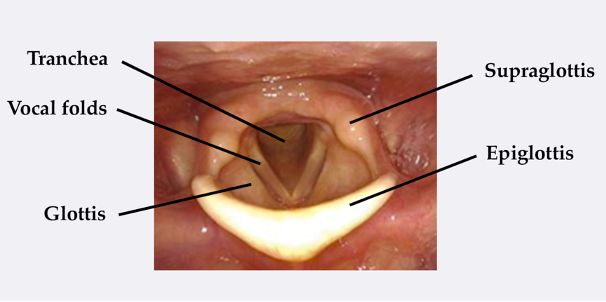
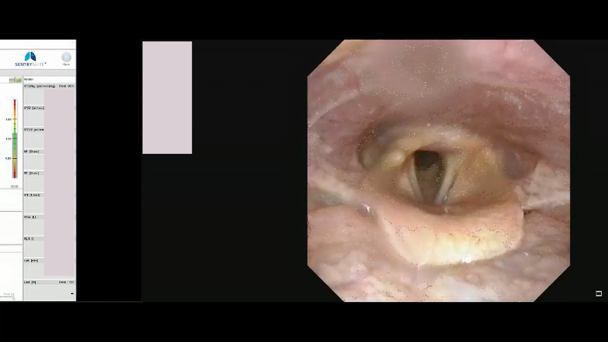
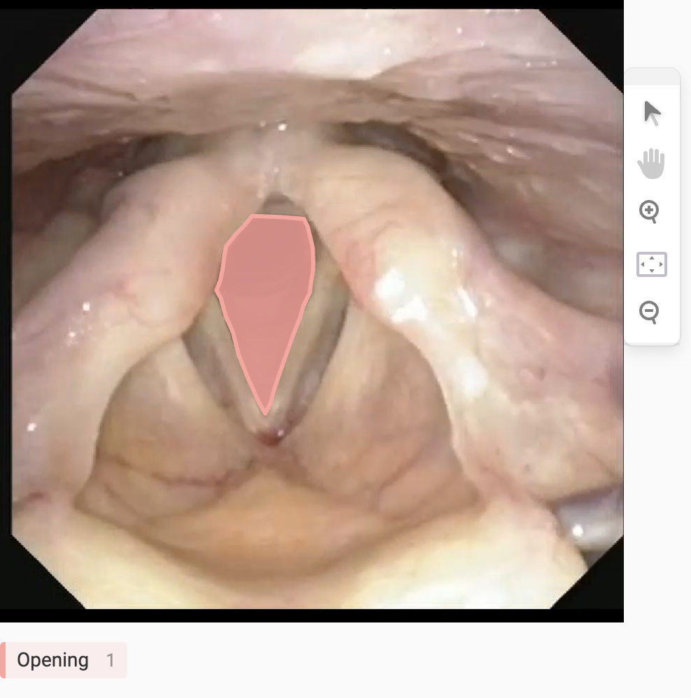

# CLE Image Segmentation

Machine learning model for segmentation of larynx video frames from CLE-tests.

## Goal and background

Induced laryngeal obstruction (ILO) is a condition that causes the laryngeal structures to narrow, often provoked by exercise. ILO is diagnosed using a CLE-test (continuous laryngoscopy exercise test). Under this test the patient is exercising, and the laryngeal structures and movements is being recorded and can be studied to manually classify the type and severity of ILO in a patient.



The projects goal is to make a machine learning model that can take a frame from a CLE-test video as input and segment the placement of the Tranchea (the throat opening).

## Raw data

All data used in this project is recorded at Haukeland University Hospital. From them I go 7 good quality videos with lengths between 8 and 15 minutes. Below is a frame from one of the videos:



## Preprocessing and labeling

These steps were taken to preprocess the raw data into training data:

1. Convert each frame of the videos into a PNG-file using the Python library **_cv2_**. (see **_utils/video_frame_extraction.py_**)
2. Crop each image to 884x884 so it only contains the actual image of the patients larynx. (see **_utils/crop_images.py_**)
3. Using [Label studio](https://github.com/heartexlabs/label-studio) to label the larynx opening for each of the images. Then export all the images with a COCO-file which contains all data of the labelling.

Screenshot from Label Studio:


This resulted in a training set of **259** images in total.

## Training with fast.ai

For training the model the fast.ai library was used.
All code for this part of the project can be found in **_models/cle-image-segmentation.ipynb_**

### DataLoaders

This is the fast.ai DataBlock. An image were given as input. Output is a binary mask where 1 is the target area (larynx opening) and 0 is the rest of the pixels in the image.

```python
image_block = DataBlock(
    blocks=(ImageBlock, MaskBlock([0, 1])),
    splitter=RandomSplitter(valid_pct=0.3, seed=42),
    get_items=get_image_files,
    get_y=get_mask_fn
)
```

A custom _get_y_ function was created to fetch the labeled mask of the input image:

```python
def get_mask_fn(img_path):
  img_name = img_path.name
  coco_file_name = f'images/4/{img_name}'
  coco_img_id = get_img_id_from_file_name(coco_file_name)
  coco_ann_id = coco_annotations.getAnnIds(coco_img_id, catIds=cat_ids)
  annotation_result = coco_annotations.loadAnns(coco_ann_id)
  if len(annotation_result) > 0:
    annotation = annotation_result[0]
    ann_mask = coco_annotations.annToMask(annotation)
    return tensor(ann_mask)
  else:
    return torch.zeros(884, 884, dtype=torch.uint8)
```

_get_mask_fn()_ uses the Python-library **_pycocotools_** to import the masks from a '_results.json_'-file with all the label/mask data. Given the image path, it returns a 884x884 PyTorch Tensor with values 0 and 1.

### Architecture

For training the UNet architecture was used. It is a well-known and widely used architecture for image segmentation tasks. UNet is used with ResNet18 in the encoder section.

```python
learner = unet_learner(dls, models.resnet18, n_out=2, metrics=[Dice])
```

## Evaluation

For evaluating both dice score and the human eye is used.

The model gives some very decent results. Read more about this in the projects notebook (**_models/cle-image-segmentation.ipynb_**).
